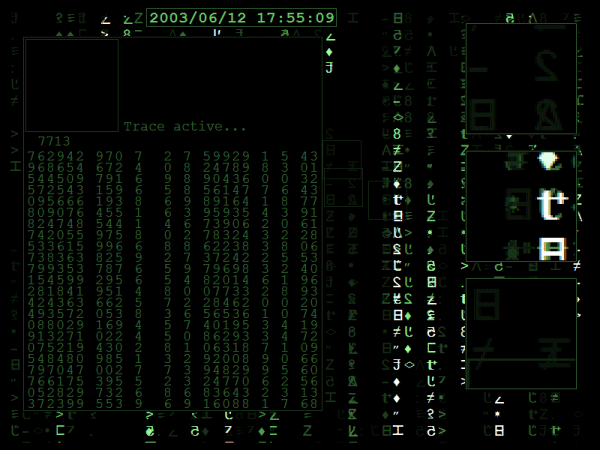



## One of best Matrix Screensavers\!

### Description

A big update of my previous version. as optimised as I can make it. API use ot bitblt, stretchblt, textout, gettickcount, rectangle, etc. Already had excellent reviews from visualbasicextreme.com, and hoped you all would like this too. each effect can be turned off through 'Settings' on Display>Screensaver. Font is part of the zip. Hope you all like :-))
 
### More Info
 

             |
---                |---
**Submitted On**   |2003-06-12 17:57:44
**By**             |[Fosters](https://github.com/Planet-Source-Code/PSCIndex/blob/master/ByAuthor/fosters.md)
**Level**          |Advanced
**User Rating**    |4.8 (92 globes from 19 users)
**Compatibility**  |VB 4\.0 \(32\-bit\), VB 5\.0, VB 6\.0
**Category**       |[Graphics](https://github.com/Planet-Source-Code/PSCIndex/blob/master/ByCategory/graphics__1-46.md)
**World**          |[Visual Basic](https://github.com/Planet-Source-Code/PSCIndex/blob/master/ByWorld/visual-basic.md)
**Archive File**   |[One\_of\_bes161105772003\.zip](https://github.com/Planet-Source-Code/fosters-one-of-best-matrix-screensavers__1-46709/archive/master.zip)

